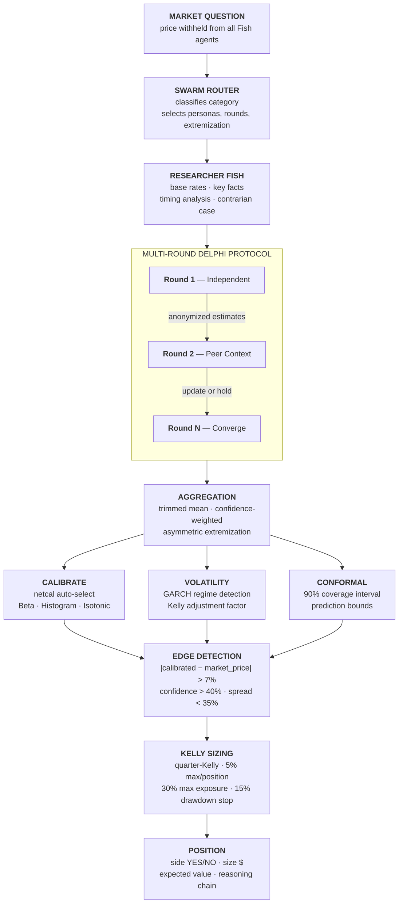
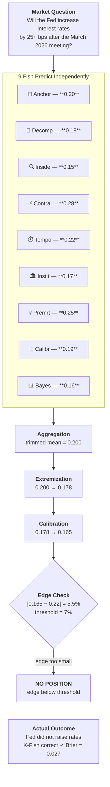
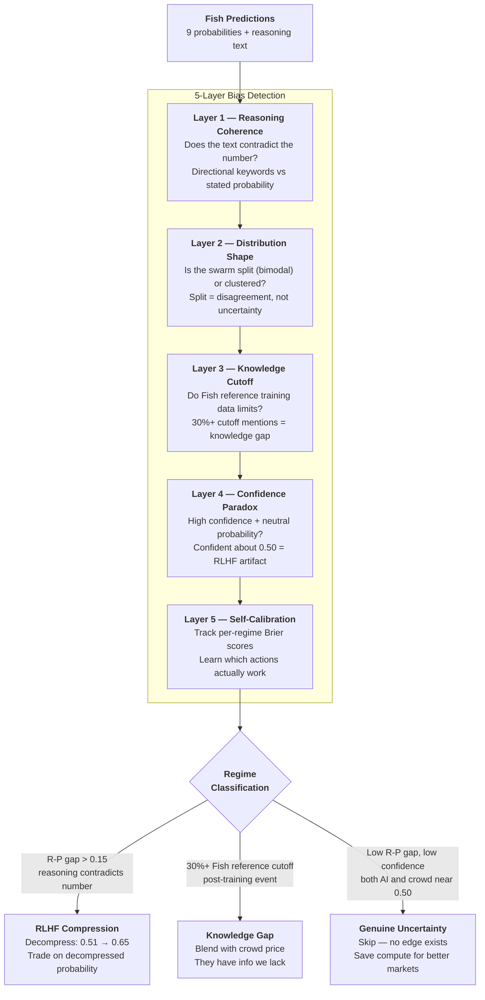
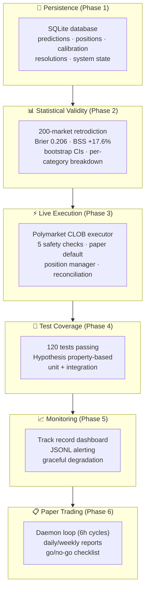
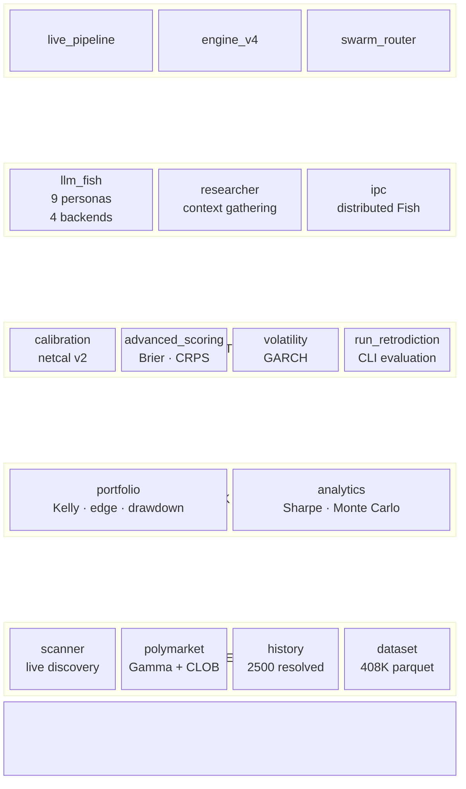
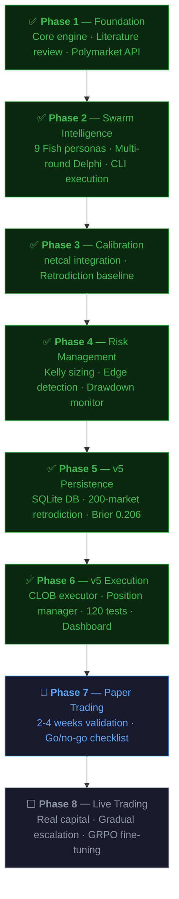

<h1 align="center">K-Fish</h1>

<p align="center">
<strong>Swarm Intelligence Prediction Engine for Prediction Markets</strong>
</p>

<p align="center">
<a href="#retrodiction-baseline"></a>
<a href="#retrodiction-baseline"></a>
<a href="#zero-cost-architecture"></a>
<a href="#fish-personas"></a>
<a href="#v5-production-features"></a>
<a href="docs/Literature_Review_Multi_Agent_LLM_Prediction_Markets.md"></a>
</p>

<p align="center">


</p>

<p align="center"><em>Named after the schooling behavior of fish — individually simple, collectively intelligent.</em></p>

---

K-Fish deploys **9 LLM agents** ("Fish") that each use a structurally different reasoning framework to analyze prediction markets. Their independent probability estimates are fused through a **multi-round Delphi protocol**, calibrated with machine learning, and converted into risk-controlled positions using the **Kelly criterion**. The entire system runs at **zero cost** via Claude Code CLI.

---

## How It Works



---

## Example Output

> **Market:** *Will the Fed increase interest rates by 25+ bps after the March 2026 meeting?*



---

## Fish Personas

<details>
<summary><strong>9 Fish — each with orthogonal reasoning</strong> (click to expand)</summary>
<br/>

Each persona encodes a **structurally different decomposition strategy** to maximize ensemble diversity ([Schoenegger et al., Science Advances 2024](https://doi.org/10.1126/sciadv.adp1528)).

| # | Fish | Reasoning Framework | Function |
|:-:|------|---------------------|----------|
| 1 | **Base Rate Anchor** | Reference class frequency | Anchors on historical base rates, adjusts minimally |
| 2 | **Decomposer** | Sub-probability multiplication | Breaks question into independent conditional sub-questions |
| 3 | **Inside View** | Domain-specific evidence | Finds the single most informative fact others miss |
| 4 | **Contrarian** | Consensus stress-testing | Constructs the strongest case for the less popular outcome |
| 5 | **Temporal Analyst** | Timing and momentum | Deadline analysis, hazard rates, trajectory |
| 6 | **Institutional Analyst** | Organizational incentives | Status quo bias, decision-maker constraints |
| 7 | **Premortem** | Failure scenario enumeration | Imagines why the expected outcome failed |
| 8 | **Calibrator** | Tetlock superforecaster protocol | Base rate → evidence → incremental update → bias check |
| 9 | **Bayesian Updater** | Explicit prior x likelihood | States prior, identifies evidence, applies Bayes' rule |

</details>

---

## Retrodiction Baseline

200 resolved Polymarket markets · 9 Fish · Claude Haiku CLI · **$0 cost** · 7.7 hours runtime

| Metric | K-Fish v5 (N=200) | K-Fish v4 (N=30) | Random |
|:------:|:-----------------:|:----------------:|:------:|
| **Brier Score** | **0.206** | 0.213 | 0.250 |
| **Accuracy** | **69.0%** | 73.3% | 50% |
| **ECE** | **0.140** | 0.178 | 0.250 |
| **BSS vs Random** | **+17.6%** | +14.8% | 0% |
| **Cost** | **$0.00** | $0.00 | — |

> [!NOTE]
> BSS (Brier Skill Score) = +17.6% means K-Fish predictions are 17.6% more accurate than random guessing. The system does not yet beat the Polymarket crowd aggregate (Brier ~0.084), which incorporates information from thousands of traders including whales and insiders. The gap is primarily driven by surprise events beyond the LLM training data cutoff.

<details>
<summary><strong>Per-Fish Performance Rankings (N=200)</strong></summary>

| Rank | Persona | Brier | Assessment |
|:----:|---------|:-----:|------------|
| 1 | Contrarian | 0.199 | Best at N=200 — consensus stress-testing adds real value |
| 2 | Inside View | 0.206 | Domain expertise remains strong |
| 3 | Premortem | 0.207 | Improved with more data (was worst at N=30) |
| 4 | Calibrator | 0.209 | Tetlock method is consistently reliable |
| 5 | Decomposer | 0.211 | Conditional decomposition adds moderate value |
| 6 | Bayesian | 0.213 | Explicit prior/likelihood reasoning |
| 7 | Temporal | 0.217 | Timing analysis improved with larger sample |
| 8 | Institutional | 0.224 | Status quo analysis less useful than expected |
| 9 | Base Rate | 0.226 | Anchoring too heavily on base rates hurts on novel events |

</details>

---

## What Makes K-Fish Different

| | [ai-hedge-fund](https://github.com/virattt/ai-hedge-fund) (43K stars) | [PolySwarm](https://arxiv.org/abs/2604.03888) | **K-Fish** |
|---|---|---|---|
| **Target** | Equities | Prediction markets | Prediction markets |
| **Agents** | 18 (investor personas) | 50 (diverse personas) | 9 (orthogonal reasoning) |
| **Calibration** | None | Confidence-weighted | netcal auto-select (Beta/Histogram/Isotonic) |
| **Multi-round** | No | No | Yes (Delphi with convergence) |
| **Pre-screen** | No | No | Yes (3-Fish filter for unknowable markets) |
| **Cost** | API calls ($) | API calls ($) | **$0.00** (CLI mode) |
| **Risk mgmt** | Position limits | Quarter-Kelly | Quarter-Kelly + GARCH volatility + drawdown circuit breaker |
| **Validated** | Backtest only | Backtest only | 200-market retrodiction on resolved markets |
| **Persistence** | None | None | SQLite (survives restart) |
| **Paper trading** | No | No | Yes (full daemon loop) |
| **AI bias exploit** | No | No | RLHF hedging decompressor + cross-market arbitrage |

---

## AI Bias Exploitation

> [!NOTE]
> Novel contribution: instead of only predicting events, K-Fish detects where AI traders are systematically wrong and exploits the bias.



<details>
<summary><strong>How the decompressor works</strong></summary>

When RLHF compression is detected (Fish reasoning says "strong evidence for YES" but probability is 0.52), the decompressor estimates the pre-hedging probability:

| Signal | Value |
|--------|-------|
| Fish stated probability | 0.52 |
| Reasoning direction score | +0.87 (strong YES) |
| Implied probability | 0.85 |
| Confidence weight | 0.60 |
| **Decompressed** | **0.655** |
| Market crowd price | 0.72 |

The decompressed probability (0.655) is much closer to the crowd truth (0.72) than the raw output (0.52). The RLHF penalty was hiding 15 percentage points of directional signal.

</details>

<details>
<summary><strong>Cross-market arbitrage</strong></summary>

Detects logically inconsistent prices across related markets:

| Type | Example | Detection |
|------|---------|-----------|
| Subset violation | P("GPT-6 released") > P("OpenAI releases model") | Buy NO on subset, YES on superset |
| Complement violation | P(A) + P(not A) != 1.0 | Arbitrage the gap |
| Spread mispricing | Correlated markets with excessive price spread | Hedged pair trade |

Constructs hedged pair positions with full 4-scenario P&L analysis.

</details>

## v5 Production Features

> [!IMPORTANT]
> v5 transforms K-Fish from a research prototype into a production trading system with persistence, execution, monitoring, and safety controls.



<details>
<summary><strong>6 Safety Rules (non-negotiable)</strong></summary>

| Rule | Enforcement |
|------|-------------|
| Paper trading is default | `paper_trading=True` in all constructors. `--live` flag + typed confirmation required. |
| Private keys never in code | Environment variables only. `.env` is gitignored. |
| Position limits are hard caps | Enforced at executor level: max $50/position, max $300 exposure. |
| Drawdown halt is automatic | Trading stops at -15%. Persisted to DB. Manual `--reset-drawdown` to resume. |
| Reconciliation runs daily | DB vs on-chain check via `--reconcile` flag. |
| Gradual escalation | Week 1-2: $25/pos. Week 3-4: $50/pos. Month 2+: evaluate. |

</details>

---

## Zero-Cost Architecture

K-Fish runs entirely on the Claude Code CLI (`claude -p`), which uses the Max subscription at **no additional API cost**.

| Backend | Cost | Speed | Automated | GPU |
|:-------:|:----:|:-----:|:---------:|:---:|
| **CLI** (`claude -p`) | $0.00 | ~15s/Fish | Yes | No |
| **Ollama** (local) | $0.00 | ~5s/Fish | Yes | Yes |
| **Gemini** (free tier) | $0.00 | ~3s/Fish | Yes | No |
| **File** (manual) | $0.00 | Manual | No | No |

---

## Quick Start

```bash
# Clone and install
git clone https://github.com/ksk5429/quant.git && cd quant
pip install -e ".[dev]"
pip install netcal scoringrules quantstats trafilatura statsforecast mlflow sentence-transformers
```

```bash
# Scan live Polymarket markets
python -m src.markets.scanner --min-volume 100000

# Start paper trading daemon (6-hour cycles, $0 cost)
bash scripts/start_paper_trading.sh

# Daily performance check
bash scripts/daily_report.sh

# Weekly statistical review with go/no-go checklist
bash scripts/weekly_review.sh
```

<details>
<summary><strong>Expected scanner output</strong></summary>

```
K-FISH MARKET SCAN — 2026-04-12 22:39
Active markets scanned: 50

Rank Score        Cat  Price       Vol($) Question
   1  3.37    general   48%  10,976,062  Will Jesus Christ return before GTA VI?
   2  3.32   politics   27%  22,267,744  Will Gavin Newsom win the 2028 Democratic...
   3  3.32   politics   42%  11,871,967  Will J.D. Vance win the 2028 Republican...
   4  3.30 geopolitics   38%  13,192,103  Iran x Israel/US conflict ends by April 7?
   5  3.26 geopolitics   30%  14,068,338  Russia x Ukraine ceasefire by end of 2026?
```

</details>

```bash
# Run retrodiction (evaluate on 30 resolved markets)
python -m src.prediction.run_retrodiction --n 30 --model haiku --concurrent 3

# Run full live pipeline (scan → analyze → portfolio)
python -m src.mirofish.live_pipeline --top 10 --model haiku
```

---

## Architecture

<details>
<summary><strong>Project Structure</strong> (click to expand)</summary>

```
src/
├── mirofish/                   # Swarm Engine
│   ├── engine_v4.py           #   Canonical pipeline with DB integration
│   ├── llm_fish.py            #   9 personas, 4 backends, asymmetric extremization
│   ├── researcher.py          #   Context gathering Fish
│   ├── swarm_router.py        #   Category routing + model competition
│   ├── live_pipeline.py       #   Scanner → Engine → Portfolio → Report
│   └── ipc.py                 #   File-based IPC for distributed Fish
├── prediction/                 # Scoring & Calibration
│   ├── calibration.py         #   netcal v2: Beta/Histogram/auto-select + CRPS
│   ├── ai_bias_detector.py    #   ★ 5-layer RLHF hedging detector + decompressor
│   ├── advanced_scoring.py    #   Brier decomposition, bootstrap CI, BSS
│   ├── batch_retrodiction.py  #   200+ market batch evaluation with DB
│   ├── volatility.py          #   GARCH regime detection
│   └── run_retrodiction.py    #   CLI-based evaluation runner
├── execution/                  #  v5  Live Trading
│   ├── polymarket_executor.py #   py-clob-client wrapper, 5 safety checks
│   ├── position_manager.py    #   Execute, resolve, reconcile positions
│   ├── live_loop.py           #   Production daemon (6h cycles)
│   └── order_types.py         #   OrderResult, ClosedPosition
├── db/                         #  v5  Persistence
│   ├── schema.sql             #   5 tables: predictions, positions, calibration, etc.
│   └── manager.py             #   DatabaseManager with context manager
├── reporting/                  #  v5  Monitoring
│   ├── dashboard.py           #   Markdown track record generator
│   └── alerts.py              #   JSONL event alerting
├── risk/                       # Position Sizing
│   ├── portfolio.py           #   Edge detection, Kelly, drawdown monitor
│   ├── arbitrage.py           #   ★ Cross-market arbitrage + hedged pair trades
│   └── analytics.py           #   Sharpe/Sortino, Monte Carlo simulation
├── markets/                    # Market Data
│   ├── polymarket.py          #   Gamma + CLOB API clients
│   ├── scanner.py             #   Live market discovery + ranking
│   ├── history.py             #   Resolved market scraper (2,500 markets)
│   └── dataset.py             #   408K market parquet loader (DuckDB)
├── semantic/                   # NLP
│   └── news_extractor.py      #   trafilatura + sentence-transformers
└── utils/                      # Infrastructure
    ├── cli.py                 #   Claude binary detection
    ├── experiment_tracker.py  #   MLflow tracking
    └── config.py              #   YAML config loader
```

</details>

<details>
<summary><strong>Module Architecture</strong> (click to expand)</summary>



</details>

---

<details>
<summary><strong>Key Design Decisions</strong> (click to expand)</summary>

> [!IMPORTANT]
> Every decision is grounded in peer-reviewed evidence or empirical retrodiction results.

| Decision | Why | Evidence |
|----------|-----|----------|
| 9 orthogonal personas | Structural reasoning diversity drives accuracy | [Schoenegger et al., Science Advances 2024](https://doi.org/10.1126/sciadv.adp1528) |
| Prices withheld from Fish | Prevents anchoring, preserves independence | [PolySwarm, arXiv:2604.03888](https://arxiv.org/abs/2604.03888) |
| Asymmetric extremization | Suppress when Fish disagree (high spread) | Retrodiction: 5 worst markets had high spread |
| 3-Fish pre-screen | Skip unknowable markets | LLM cutoff caused Brier 0.95+ on surprises |
| Quarter-Kelly | Full Kelly has ~25% drawdowns | [Kelly 1956](https://doi.org/10.1002/j.1538-7305.1956.tb03809.x) |
| Auto-seeded calibrator | No uncalibrated cold start | Code review: calibration was always a no-op |
| CLI over API | $0 vs $3-15/M tokens | Maximize predictions per dollar |

</details>

<details>
<summary><strong>Libraries</strong> (click to expand)</summary>

| Library | Purpose | Why This One |
|---------|---------|-------------|
| [netcal](https://github.com/EFS-OpenSource/calibration-framework) | Probability calibration | 10+ methods, auto-select by sample size |
| [scoringrules](https://github.com/frazane/scoringrules) | CRPS, Brier, log score | JAX/Numba backends |
| [quantstats](https://github.com/ranaroussi/quantstats) | Portfolio analytics | Sharpe, Sortino, Calmar, Monte Carlo |
| [trafilatura](https://github.com/adbar/trafilatura) | News extraction | 0.958 F1, used by HuggingFace/IBM |
| [sentence-transformers](https://www.sbert.net/) | Semantic embeddings | Market similarity, news matching |
| [statsforecast](https://github.com/Nixtla/statsforecast) | GARCH volatility | 20x faster than pmdarima |
| [MLflow](https://mlflow.org/) | Experiment tracking | Model registry for calibrators |
| [mapie](https://github.com/scikit-learn-contrib/MAPIE) | Conformal prediction | Coverage-guaranteed intervals |

</details>

---

## Project Stats

| Metric | Value |
|--------|:-----:|
| Python source lines | ~17,000 |
| Source modules | 37 |
| Unit tests passing | 120 |
| Code reviews completed | 5 |
| Bugs found and fixed | 42 |
| Retrodiction markets | 200 |
| Resolved market corpus | 2,500 |
| External dataset | 408,863 markets |
| Libraries integrated | 11 |

---

## Research Foundation

> [!TIP]
> Full literature review with 45 references: **[Literature Review](docs/Literature_Review_Multi_Agent_LLM_Prediction_Markets.md)**

| Claim | Evidence |
|-------|----------|
| LLM ensembles match human crowds | [Schoenegger et al., Science Advances 2024](https://doi.org/10.1126/sciadv.adp1528) |
| Retrieval-augmented LLMs approach superforecasters | [Halawi et al., NeurIPS 2024](https://arxiv.org/abs/2402.18563) |
| 50-persona swarm outperforms single-model on Polymarket | [PolySwarm, arXiv:2604.03888](https://arxiv.org/abs/2604.03888) |
| RLHF models are overconfident, need calibration | [Geng et al., NAACL 2024](https://aclanthology.org/2024.naacl-long.366/) |
| Semantic similarity outperforms price correlation | [Baaijens et al., Applied Network Science 2025](https://doi.org/10.1007/s41109-025-00755-2) |

---

## Roadmap



---

<p align="center">
<sub>Built with structured human-AI collaboration · Paper trading is the default · Live trading requires explicit human approval</sub>
</p>

