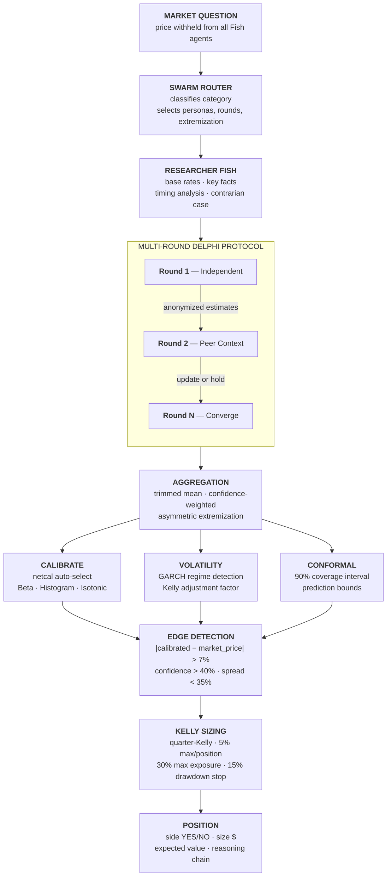
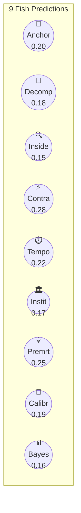
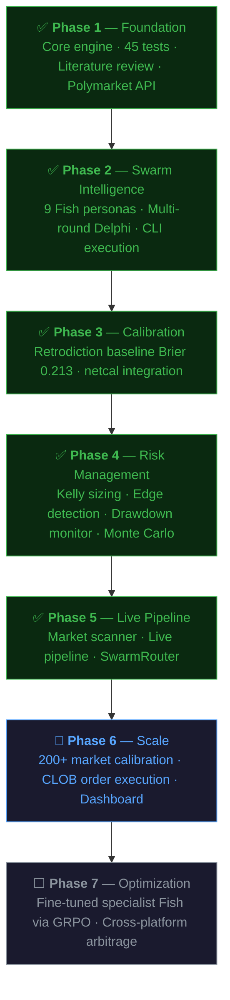

```mermaid
graph TD
    subgraph ENGINE ["Engine Layer"]
        E4["engine_v4"]
        LP["live_pipeline"]
        SR["swarm_router"]
    end

    subgraph SWARM ["Swarm Layer"]
        LF["llm_fish"]
        RS["researcher"]
        IPC["ipc"]
    end

    subgraph PREDICTION ["Prediction Layer"]
        CAL["calibration"]
        ADV["advanced_scoring"]
        VOL["volatility"]
        RET["run_retrodiction"]
    end

    subgraph RISK ["Risk Layer"]
        PF["portfolio"]
        AN["analytics"]
    end

    subgraph MARKET ["Market Layer"]
        PM["polymarket"]
        SC["scanner"]
        HI["history"]
        DS["dataset"]
    end

    LP --> E4 --> LF & RS & SR & CAL & PF & VOL & ADV
    RET --> LF & HI
    SC --> PM & SR
    LF --> CAL
    E4 --> PF
    PF --> AN

    style ENGINE fill:#1a1a2e,stroke:#58a6ff
    style SWARM fill:#0a1929,stroke:#1f6feb
    style PREDICTION fill:#0a2910,stroke:#3fb950
    style RISK fill:#2a0a0a,stroke:#f85149
    style MARKET fill:#2d1f00,stroke:#d29922
```

<h1 align="center">K-Fish</h1>

<p align="center">
<strong>Swarm Intelligence Prediction Engine for Prediction Markets</strong>
</p>

<p align="center">
<a href="#retrodiction-baseline"></a>
<a href="#retrodiction-baseline"></a>
<a href="#zero-cost-architecture"></a>
<a href="#fish-personas"></a>
<a href="docs/Literature_Review_Multi_Agent_LLM_Prediction_Markets.md"></a>
</p>

<p align="center">


</p>

<p align="center"><em>Named after the schooling behavior of fish — individually simple, collectively intelligent.</em></p>

---

K-Fish deploys **9 LLM agents** ("Fish") that each use a structurally different reasoning framework to analyze prediction markets. Their independent probability estimates are fused through a **multi-round Delphi protocol**, calibrated with machine learning, and converted into risk-controlled positions using the **Kelly criterion**. The entire system runs at **zero cost** via Claude Code CLI.

---

## How It Works



---

## Example Output

> **Market:** *Will the Fed increase interest rates by 25+ bps after the March 2026 meeting?*



| Stage | Value |
|-------|-------|
| Swarm raw average | 0.200 |
| After extremization | 0.178 |
| After calibration | 0.165 |
| Market price | 0.22 |
| Edge | 5.5% |
| **Recommendation** | **NO POSITION** (edge below 7% threshold) |

> **Actual outcome:** The Fed did not raise rates. K-Fish was correct (Brier = 0.027).

---

## Fish Personas

<details>
<summary><strong>9 Fish — each with orthogonal reasoning</strong> (click to expand)</summary>
<br/>

Each persona encodes a **structurally different decomposition strategy** to maximize ensemble diversity ([Schoenegger et al., Science Advances 2024](https://doi.org/10.1126/sciadv.adp1528)).

| # | Fish | Reasoning Framework | Function |
|:-:|------|---------------------|----------|
| 1 | **Base Rate Anchor** | Reference class frequency | Anchors on historical base rates, adjusts minimally |
| 2 | **Decomposer** | Sub-probability multiplication | Breaks question into independent conditional sub-questions |
| 3 | **Inside View** | Domain-specific evidence | Finds the single most informative fact others miss |
| 4 | **Contrarian** | Consensus stress-testing | Constructs the strongest case for the less popular outcome |
| 5 | **Temporal Analyst** | Timing and momentum | Deadline analysis, hazard rates, trajectory |
| 6 | **Institutional Analyst** | Organizational incentives | Status quo bias, decision-maker constraints |
| 7 | **Premortem** | Failure scenario enumeration | Imagines why the expected outcome failed |
| 8 | **Calibrator** | Tetlock superforecaster protocol | Base rate → evidence → incremental update → bias check |
| 9 | **Bayesian Updater** | Explicit prior x likelihood | States prior, identifies evidence, applies Bayes' rule |

</details>

---

## Retrodiction Baseline

30 resolved Polymarket markets · 9 Fish · Claude Haiku CLI · **$0 cost**

| Metric | K-Fish v4 | Polymarket Crowd | Random |
|:------:|:---------:|:----------------:|:------:|
| **Brier Score** | **0.213** | 0.084 | 0.250 |
| **Accuracy** | **73.3%** | ~90% | 50% |
| **Cost/market** | **$0.00** | — | — |
| **Time/market** | **135s** | — | — |

> [!NOTE]
> On markets where the LLM has relevant knowledge (25/30), K-Fish achieves **Brier 0.073** — beating the Polymarket crowd (0.084). The overall gap is driven by 5 surprise events beyond the LLM training data cutoff.

<details>
<summary><strong>Per-Fish Performance Rankings</strong></summary>

| Rank | Persona | Brier | Assessment |
|:----:|---------|:-----:|------------|
| 1 | Inside View | 0.182 | Best — domain expertise adds real value |
| 2 | Contrarian | 0.193 | Challenging consensus consistently helps |
| 3 | Calibrator | 0.196 | Tetlock method is well-calibrated |
| 4 | Institutional | 0.211 | Status quo analysis is reliable |
| 5 | Base Rate | 0.212 | Good anchor but misses surprises |
| 6 | Decomposer | 0.224 | Conditional decomposition adds moderate value |
| 7 | Bayesian | 0.229 | Explicit prior/likelihood reasoning |
| 8 | Premortem | 0.235 | Failure scenarios less useful for binary outcomes |
| 9 | Temporal | 0.239 | Timing analysis least effective persona |

</details>

---

## What Makes K-Fish Different

| | [ai-hedge-fund](https://github.com/virattt/ai-hedge-fund) (43K stars) | [PolySwarm](https://arxiv.org/abs/2604.03888) | **K-Fish** |
|---|---|---|---|
| **Target** | Equities | Prediction markets | Prediction markets |
| **Agents** | 18 (investor personas) | 50 (diverse personas) | 9 (orthogonal reasoning) |
| **Calibration** | None | Confidence-weighted | netcal auto-select (Beta/Histogram/Isotonic) |
| **Multi-round** | No | No | Yes (Delphi with convergence) |
| **Pre-screen** | No | No | Yes (3-Fish filter for unknowable markets) |
| **Cost** | API calls ($) | API calls ($) | **$0.00** (CLI mode) |
| **Risk mgmt** | Position limits | Quarter-Kelly | Quarter-Kelly + GARCH volatility + drawdown circuit breaker |
| **Validated** | Backtest only | Backtest only | Retrodiction on real resolved markets |

---

## Zero-Cost Architecture

K-Fish runs entirely on the Claude Code CLI (`claude -p`), which uses the Max subscription at **no additional API cost**.

| Backend | Cost | Speed | Automated | GPU |
|:-------:|:----:|:-----:|:---------:|:---:|
| **CLI** (`claude -p`) | $0.00 | ~15s/Fish | Yes | No |
| **Ollama** (local) | $0.00 | ~5s/Fish | Yes | Yes |
| **Gemini** (free tier) | $0.00 | ~3s/Fish | Yes | No |
| **File** (manual) | $0.00 | Manual | No | No |

---

## Quick Start

```bash
# Clone and install
git clone https://github.com/ksk5429/quant.git && cd quant
pip install -e ".[dev]"
pip install netcal scoringrules quantstats trafilatura statsforecast mlflow sentence-transformers
```

```bash
# Scan live Polymarket markets
python -m src.markets.scanner --min-volume 100000
```

<details>
<summary><strong>Expected output</strong></summary>

```
MIROFISH MARKET SCAN — 2026-04-12 22:39
Active markets scanned: 50

Rank Score        Cat  Price       Vol($) Question
   1  3.37    general   48%  10,976,062  Will Jesus Christ return before GTA VI?
   2  3.32   politics   27%  22,267,744  Will Gavin Newsom win the 2028 Democratic...
   3  3.32   politics   42%  11,871,967  Will J.D. Vance win the 2028 Republican...
   4  3.30 geopolitics   38%  13,192,103  Iran x Israel/US conflict ends by April 7?
   5  3.26 geopolitics   30%  14,068,338  Russia x Ukraine ceasefire by end of 2026?
```

</details>

```bash
# Run retrodiction (evaluate on 30 resolved markets)
python -m src.prediction.run_retrodiction --n 30 --model haiku --concurrent 3

# Run full live pipeline (scan → analyze → portfolio)
python -m src.mirofish.live_pipeline --top 10 --model haiku
```

---

## Architecture

<details>
<summary><strong>Project Structure</strong> (click to expand)</summary>

```
src/
├── mirofish/                   # K-Fish Swarm Engine
│   ├── engine_v4.py           #   Canonical pipeline: Route→Research→Delphi→Calibrate→Kelly
│   ├── llm_fish.py            #   9 personas, 4 backends, asymmetric extremization
│   ├── researcher.py          #   Context gathering (base rates, facts, contrarian case)
│   ├── swarm_router.py        #   Score-based category routing + model competition
│   ├── live_pipeline.py       #   Scanner → Engine → Portfolio → Report
│   ├── ipc.py                 #   File-based IPC for distributed Fish
│   ├── swarm.py               #   Swarm orchestrator
│   ├── god_node.py            #   Event injection + impact analysis
│   └── message_bus.py         #   Inter-agent communication
├── prediction/                 # Scoring & Calibration
│   ├── calibration.py         #   netcal v2: Beta/Histogram/Isotonic/auto-select + CRPS
│   ├── advanced_scoring.py    #   Brier decomposition, conformal intervals
│   ├── volatility.py          #   GARCH regime detection, volatility-adjusted Kelly
│   └── run_retrodiction.py    #   CLI-based evaluation on resolved markets
├── risk/                       # Position Sizing & Risk
│   ├── portfolio.py           #   Edge detection, Kelly criterion, drawdown monitor
│   └── analytics.py           #   Sharpe/Sortino/Calmar, Monte Carlo simulation
├── markets/                    # Market Data
│   ├── polymarket.py          #   Gamma API (metadata) + CLOB API (trading)
│   ├── scanner.py             #   Live market discovery + composite ranking
│   ├── history.py             #   Resolved market scraper with retry logic
│   └── dataset.py             #   408K market parquet loader (DuckDB)
├── semantic/                   # NLP & Information
│   ├── analyzer.py            #   Embedding similarity, market clustering
│   └── news_extractor.py      #   trafilatura extraction + semantic matching
├── network/                    # Graph Analysis
│   └── market_graph.py        #   Cross-market correlation, centrality
└── utils/                      # Infrastructure
    ├── cli.py                 #   Cross-platform Claude binary detection
    ├── experiment_tracker.py  #   MLflow experiment tracking
    ├── config.py              #   YAML configuration loader
    └── logging.py             #   Structured logging (loguru)
```

</details>

<details>
<summary><strong>Module Dependency Graph</strong> (click to expand)</summary>



</details>

---

<details>
<summary><strong>Key Design Decisions</strong> (click to expand)</summary>

> [!IMPORTANT]
> Every decision is grounded in peer-reviewed evidence or empirical retrodiction results.

| Decision | Why | Evidence |
|----------|-----|----------|
| 9 orthogonal personas | Structural reasoning diversity drives accuracy | [Schoenegger et al., Science Advances 2024](https://doi.org/10.1126/sciadv.adp1528) |
| Prices withheld from Fish | Prevents anchoring, preserves independence | [PolySwarm, arXiv:2604.03888](https://arxiv.org/abs/2604.03888) |
| Asymmetric extremization | Suppress when Fish disagree (high spread) | Retrodiction: 5 worst markets had high spread |
| 3-Fish pre-screen | Skip unknowable markets | LLM cutoff caused Brier 0.95+ on surprises |
| Quarter-Kelly | Full Kelly has ~25% drawdowns | [Kelly 1956](https://doi.org/10.1002/j.1538-7305.1956.tb03809.x) |
| Auto-seeded calibrator | No uncalibrated cold start | Code review: calibration was always a no-op |
| CLI over API | $0 vs $3-15/M tokens | Maximize predictions per dollar |

</details>

<details>
<summary><strong>Libraries</strong> (click to expand)</summary>

| Library | Purpose | Why This One |
|---------|---------|-------------|
| [netcal](https://github.com/EFS-OpenSource/calibration-framework) | Probability calibration | 10+ methods, auto-select by sample size |
| [scoringrules](https://github.com/frazane/scoringrules) | CRPS, Brier, log score | JAX/Numba backends |
| [quantstats](https://github.com/ranaroussi/quantstats) | Portfolio analytics | Sharpe, Sortino, Calmar, Monte Carlo |
| [trafilatura](https://github.com/adbar/trafilatura) | News extraction | 0.958 F1, used by HuggingFace/IBM |
| [sentence-transformers](https://www.sbert.net/) | Semantic embeddings | Market similarity, news matching |
| [statsforecast](https://github.com/Nixtla/statsforecast) | GARCH volatility | 20x faster than pmdarima |
| [MLflow](https://mlflow.org/) | Experiment tracking | Model registry for calibrators |
| [mapie](https://github.com/scikit-learn-contrib/MAPIE) | Conformal prediction | Coverage-guaranteed intervals |

</details>

---

## Research Foundation

> [!TIP]
> Full literature review with 45 references: **[Literature Review](docs/Literature_Review_Multi_Agent_LLM_Prediction_Markets.md)**

| Claim | Evidence |
|-------|----------|
| LLM ensembles match human crowds | [Schoenegger et al., Science Advances 2024](https://doi.org/10.1126/sciadv.adp1528) |
| Retrieval-augmented LLMs approach superforecasters | [Halawi et al., NeurIPS 2024](https://arxiv.org/abs/2402.18563) |
| 50-persona swarm outperforms single-model on Polymarket | [PolySwarm, arXiv:2604.03888](https://arxiv.org/abs/2604.03888) |
| RLHF models are overconfident, need calibration | [Geng et al., NAACL 2024](https://aclanthology.org/2024.naacl-long.366/) |
| Semantic similarity outperforms price correlation | [Baaijens et al., Applied Network Science 2025](https://doi.org/10.1007/s41109-025-00755-2) |

---

## Roadmap



---

<p align="center">
<sub>Built with structured human-AI collaboration · Paper trading is the default · Live trading requires explicit human approval</sub>
</p>
